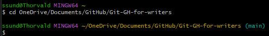
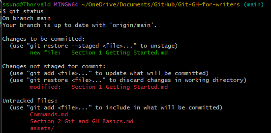

### Unix commands
**pwd**: Returns the path of the current directory (print working directory)

**ls**: Returns list of directories (folders) and files in the current directory 

**mkdir**: Makes new directory but won't change to that directory

**cd**: Use to move to a different directory.
* **cd _name_** => Specify the name of the directory to change to

    

* **cd .** =>  Current directory    

* **cd ..** => Moves one directory up 

* **cd ~** => Moves to home directory   

### Git Command Line Shortcuts
* **Tab**: Fills in the rest of the directory name when possible
* **Up arrow**: Scrolls through previous commands

### Command Structure
_command -o --option argument(s)_
* Options modify the command
    * Use one dash for one-letter options
        ```
        git commit -m "Marketing changes"
        ```
    * Use two dashes for multiple letter options
    * A command can contain more than one option
* Arguments are additional data
    * If an argument is comprised of multiple elements that are separated by spaces, put the elements in quotes.
        ```
        git config --global user.name "Anna Hoffman"

### Useful Git Commands
**git status**: Shows status of files in a directory. Untracked files are unstaged files.



**git add _filename_**: Use to stage a specific file.

**git add .**: Use to stage all files and folders within the current directory.

**git reset HEAD _filename_**: Unstage

**git commit -m "_message_"**: Use to commit all staged files that are not committed 

**git push --set-upstream origin main**: Used to set the upstream branch for the local branch and push the changes to the remote repository. When you create a new branch locally, Git does not automatically know which remote branch it should be associated with. The --set-upstream option helps to establish this association.

**git push**: Use to upload local commits to the remote repository branch. By default, Git selects the remote repository named origin and the current branch to push. The command syntax is _$ git push remote branch_. If a push is successful, refresh your repo in GitHub to see your commits. 

**mv old-file-name new-file-name**: Delete the old file and create a new file. 

**rm filename**: Delete a file.

**git log**: Shows your history.

**git log --oneline**: Shows history in abbreviated form; easier to read.

**git checkout _commit_**: Sets the commit to work on, use to set the current verion (HEAD) to an older version. When you use this command, Git modiifes the .md file so you'll get a message about reloading the file. Click **Yes**.

**git chekout main**: Sets the current verion (HEAD) to the most recent on the main branch

**git tag**: To view all tags

**git tag -a _tag-name_ -m _"Message about tag"_**: The message is the description of the tag

**git checkout tags/_tag-name_**: Checkout a commit with a tag

**git push origin _tagname_**: Push to GitHub

**git branch _branch-name_**: Creates branch name but doesn't move you to the branch.

**git checkout -b _branch-name_**: Creates branch and moves you to it. 
> [!Note] Best practice to commit or [stash](#lesson-29-stash) your current branch changes before moving to another branch. 

**git checkout _branch-name_**: Moves you to the specified branch. 

**git branch**: Displays all branches and indicates your current branch. 

    You can also use _git status_ to view the current branch, any changes that have been staged for the next commit, changes that haven't been staged, and untracked files. 

**git brand -d _branch-name_**: Deletes branch.

    You can also delete a branch in GitHub. You will see the change locally when you do a pull. 

**git push --set-upstream origin _branch-name_**: Use when you initially push a branch to GitHub.

**git stash**: Creates stash and reverts to the most recent commit.

**git stash save "_stash-name_"**: Use to create a stash name so that you can easily identify it in a stash list. Naming your stashes is good practice.

**git stash list**: Lists the most recents stashes. 

In this example, there is only one stash for the master branch. _In the middle_ is the stash name. 


**git stash pop**: Restores the changes to the most recent stash on the stack. The changes are unstaged.