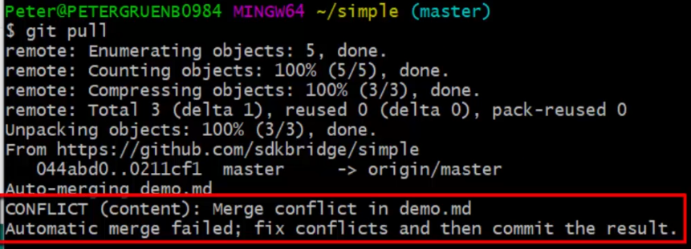
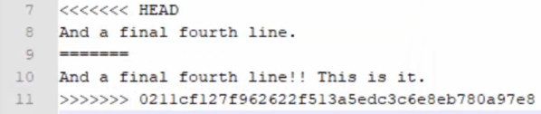
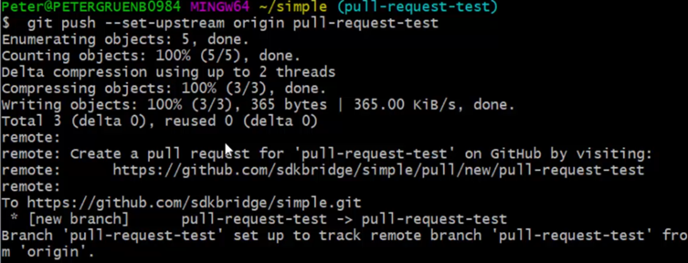
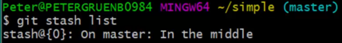

# Section 3 Tag, Pull, Branch, Stash, and Cloning

## Lesson 22 Tags

A tag is a label assigned to a commit to make it easy to locate. Commonly, tags correspond to files that are part of a release.

Tags include a name and an optional, but recommended, description. Tags are applied locally and then pushed to GitHub.

You can push the tag for an older version (the version you checked out) without causing issues in GitHub. If you assign a tag then you can use the tag instead of the alphanumeric identifier of an old commit with checkout command. To view tags in GitHub, use the dropdown with branch (or main).

### Tag Commands

**git tag**: To view all tags

**git tag -a _tag-name_ -m _"Message about tag"_**: The message is the description of the tag

**git checkout tags/_tag-name_**: Checkout a commit with a tag

**git push origin _tagname_**: Push to GitHub

## Lesson 24 Pull
### Collaboration
* Version controls lets multiple contributors work on a file at the same time. Everyone has their own copy of the file.
* You can control how the separate changes are incoroprated.

The **git pull** command downloads all commits that have been pushed to the repo. Use the command to merge any commits that others have pushed to GitHub into your local copy.

Best practice is to pull after you commit. Don't pull/merge unless you are at a good stopping point.

### Handling pulls
The local file changes or doesn't change depending on these circumstances:
1. Remote file hasn't changed since your last pull.  
   
   The local file remains unchanged.
2. Remote file has changed but the local file has not.

   The local file is replaced with the remote file.
3. Both the local and remote files have changed.
    
    The changes from the remote file are merged into the local file if possible. See [Conflict](#conflict).     

> [!IMPORTANT]    
> Per instructor, editing in GitHub is not a best practice.

### Merging

Git compares the documents line by line
* If the line hasn't changed either remotely or locally, then the line remains the same.
* If the line is changed either remotely or locally, then the changed line is used.
* If the line has changed both remotely and locally, then a conflict occurs.

#### Conflict
* You are notified in GitBash when a conflict occurs.

    
* Both the conflicting lines are marked with <<<<<<< >>>>>>> symbols in the updated local file. The line from the HEAD, which is the local version is identified, as is the line from the repo version. The ID number from the repo version is also identified.

    
* Edit the local file to resolve the conflict, and remove the symbols.
* Perform these commands after you resolve the conflict:
    1. Stage => _git add .._
    2. Commit => _git commit -m "description of merge resolution"_
    3. Pull latest changes from repo=> _git pull_
    4. Push resolved conflict changes to refresh GitHub => _git push_

#### Binary files
Binary files, such as images, audio, and video files, cannot be merged by Git. You must select a version to use in Git. Any merging of binary files must be done using other software/app.

#### Fetch

The _git pull_ command combines the _git fetch_ and _git merge_ commands. You can use the commands separately for finer control of the merge process but as a writer, you can probably use the pull process with no issue.

## Lesson 26 Branches
When a repo is created, it has one branch called main. It is the root branch. Typically you don't work on the branch. Instead you create another branch, update the new branch, and then merge it back into the main branch.

Branches are variations of files for specific purposes, such as adding a new feature or fixing a bug.

After you have updated the branch, merge it back into the branch where it came from (main or another branch). The merge is considered a commit. Note that commits can continue on the original branch while work is being done on a subordinate branch.

### Branch names | Best practices
* Use alphanumerics, dashes, periods, and forward slashes
* Case sensitive
* Common to use lowercase with dashes between words, i.e. api-docs
* Slashes are used to create groups of branches, i.e. v1.2/api-docs, v1.2/login-fix, etc.

### Branch commands

**git branch _branch-name_**: Creates branch name but doesn't move you to the branch.

**git checkout -b _branch-name_**: Creates branch and moves you to it. 
> [!Note] 
> Best practice to commit or [stash](#lesson-29-stash) your current branch changes before moving to another branch. 

**git checkout _branch-name_**: Moves you to the specified branch. 

**git branch**: Displays all branches and indicates your current branch. 

You can also use _git status_ to view the current branch, any changes that have been staged for the next commit, changes that haven't been staged, and untracked files. 

**git brand -d _branch-name_**: Deletes branch.

You can also delete a branch in GitHub. You will see the change locally when you do a pull. 

**git push --set-upstream origin _branch-name_**: Use when you initially push a branch to GitHub.

* The upstream branch is the branch from where the new branch branches off of. By default, Git uses _origin_ but you can change the name. 

* When you use the upstream command, you don't have to use the _git push_ command.

* If you use _git push_, Git will tell you to use the upstream command.

See [Lesson 31 Merging branches](#lesson-31-merging-branches).

## Lesson 29 Stash

A stash is a temporary commit. Use it when you don't want to commit your work but you have to switch to another branch for some reason. 

Each time you create a stash, it goes to the top of the "stack". Each stash is given an index number => {0} or {1}, etc. 0 is the top of the stack. When you pop a stash, it is removed from the stack and the second most recent stash moves to the top of the stack. The stack is like a stack of dishes with each stash respresenting a plate.

### Stashing process
1. Stash your commit.
2. Git reverts to your last commit.
3. Switch to the other branch.
4. Return to the branch with the stash.
5. Pop your stash to access the changes you were working on.

### Stashing commands

**git stash**: Creates stash and reverts to the most recent commit.

**git stash save "_stash-name_"**: Use to create a stash name so that you can easily identify it in a stash list. Naming your stashes is good practice.

**git stash list**: Lists the most recents stashes. 

In this example, there is only one stash for the master branch. _In the middle_ is the stash name.
 

**git stash pop**: Restores the changes to the most recent stash on the stack. The changes are unstaged.

## Lesson 31 Merging Branches

Can merge two branches with Git command line or using GitHub. GitHub is easier (because of visuals) but you must first push the changes in both branches to Github before the merge. 

### Pull request
> [!NOTE]
> IRL someone will review your request to merge and then approve.
1. Create a pull request in GitHub when ready to merge branches.
2. GitHub will merge automatically if no conflicts.
3. If conflicts occur, GitHub displays them and the approver resolves them before merging.

### Types of merge requests
The type of merge request to use is usually a corporate decision.

* **Merge pull request**: Results in multiple commits on original branch => every commit from the new branch becomes a commit on the original branch.

* **Squash and merge pull request**: All commits on new branch are applied to the original branch as one commit. This method simplifies the history.

### Merging in GitHub
1. In the main branch (or whichever branch you want to add the info to), click **New pull request** on the Pull requests tab.
2. Confirm/select the base and compare branches. The compare branch is the branch you are going to merge into the base. 

    Github will indicate if the branches can be automatically merged.
3. Specify a note to summarize the merge. Add additional info in the Write tab.
4. Click **Create pull request**.
5. The person reviewing the merge request can look at the Conversations, Commits, Checks, and Files changed tabs to review the branch. Can click **Review change** to leave comments, approve chnage, or request change for each change in the branch.
6. Click **Merge pull request** and then click **Confirm merge**. 

    You can use the drop-down arrow to select **Squash and merge** or **Rebase and merge**. See [Rebasing](./Section%204%20Advanced%20Features.md#Rebasing).
7. After _Pull request successfully merged and closed_ messge is displayed, click **Delete branch**.
8. Pull the updated branch locally so you have the latest version.

### Conflicts when merging in GitHub
If conflicts occurs because the same line/info is changed in both branches, a _Can't automatically merge_ message is dislayed when you create a new pull request. Click **Resolve** after you complete the pull request. Fix the conflicts and then click **Confirm merge**.

### Merging at command line
Use these commands:

1. Use _cd_ command to go to the branch in which you want to incorporate the changes from the other branch.
2. _git diff branch-name1 . . . branch-name2_
    
    Use the view the differences between the files.

3. _git merge new-branch_ 

    Merges the specified branch into the current branch.

## Lesson 33 Cloning
Cloning makes a local copy of a remote repo. It includes copies of all the files, including hidden files, and history so that you can checkout any branch or previous commit.

### Cloning from GitHub
1. In GitHub, open the repository.
2. On the Clone tab, click **Code**.
3. Copy the HTTPS URL.
4. In Git Bash, enter these commands:

    a. _cd ~_ to go to home directory

    b. _git clone copiedURL_

#### Origin
Origin is a shortcut in Git for the URL you cloned your repo from. In theory, you can push changes to other repos but that is unusual. 

#### HTTPS v SSH (secure shell)
You can clone either. HTTPS is simpler but SSH may nbe more secure. To use SSH, you must generate a SSH key and provide a passphrase.

