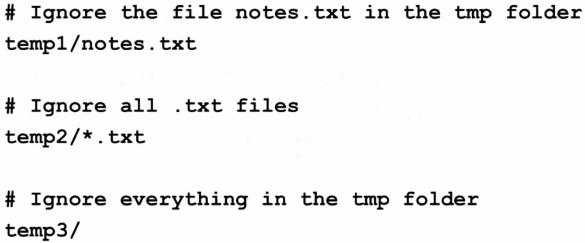

# Section 4 Advanced Features

## Lesson 35 Rebasing

Rebasing is a way to simplify history, reorganizing/rewriting your history as if you branched later, such as on the last commit of the branch. It accomplishes the same thing as merging, but the history of a merge is more complicated.

As a writer, you are unlikely to rebase.

## Lesson 36 Handling Problems

If you can't perform an action (push, pull, etc.), try to figure out why. Note that Git does not have an undo command other than reverting to another version. Git does not have a trash folder either so things are permanently gone.

### Revert to Last Working Version
1. Copy your changed files to a folder outside the repo.
2. Revert your changes to the version where Git works.
3. Manually merge (cut/paste) the changes from folder outside the repo into the folder inside the repo.

### Revert to Unstaged Changes
To unstage changes that have been staged (git add .) but not committed:
```
git reset --hard
```

### Make Local Version Same as Remote
```
git fetch origin
git reset --hard origin/branch-name
```
    
### Start Over with New Repo
1. Copy files to outside the repo.
2. Delete the local repo.
3. Clone the repo into a new folder.
4. Manually merge (cut/paste) the changes into the newly cloned repo.

## Lesson 37 Ignoring Files
You should only have source files in Git but you may have some files, like notes in a text files, that you want to store locally.

### Create a Hidden Ignore File

1. Create a _.gitignore_ text file in the top level of your local repo.
2. List any folder/files to ignore. You can use wildcards.
3. Add file to the repo and commit. Because it starts with a period, it is hidden. 

#### File Structure of Ignore File
* Start comments with #
* List files using path
* Use * as wildcard
* Folders must end with /

Example



## Forking

A fork is a copy of a repo that allows you to experiment without affecting the orginal project. It is similar to branching but branching occurs in the same repo whereas forking occurs across GitHub accounts. Branching is part of Git but forking is part of GitHub.

After you create a fork and make changes, you can create pull requests to merge your changes into the original GitHub project. The owner of the orginal project decides which changes to keep.

Most common use of forking is with open source projects or non-public projects where team members fork and then create pull requests.

### To create a fork
1. Locate the project.
2. Click **Fork > Create New Fork**.
3. After you make updates, click **Create Pull Request** and then follow instructions.

## Lesson 40 Creating Documentation and Next Steps

You can use GitHub for documentation by creating Markdown or Restructured text files. It is bare bones, simple with unsophiticated navigation. See [raspberrypi/documentation](https://github.com/raspberrypi/documentation) in GitHub.


### Common Scenario
1. Use Github to host files.
2. Webmaster uses local copy of repo to run scripts to turn files into html. (Jekyll => .md, Sphinx => .rst), asciidoctor => .adoc)


